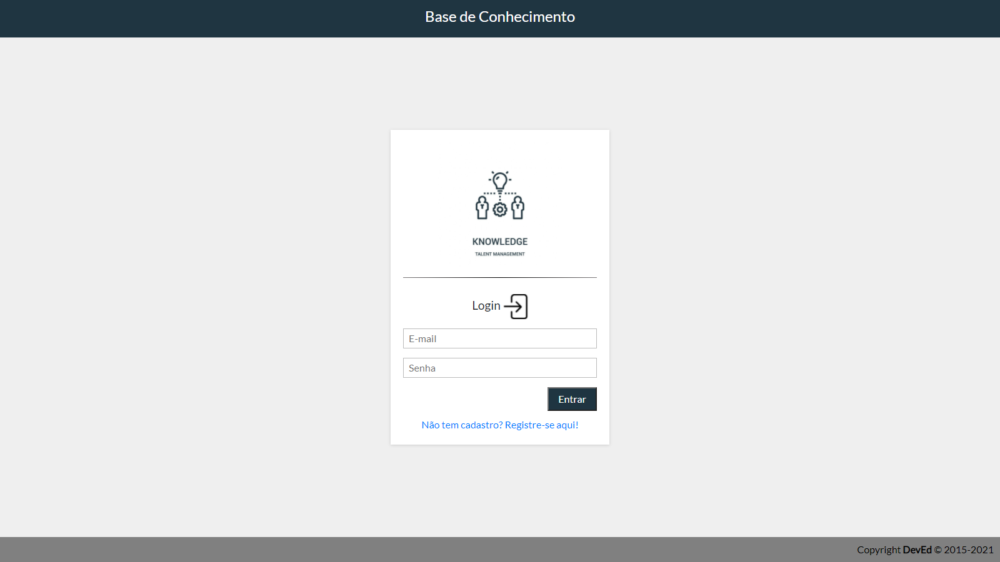
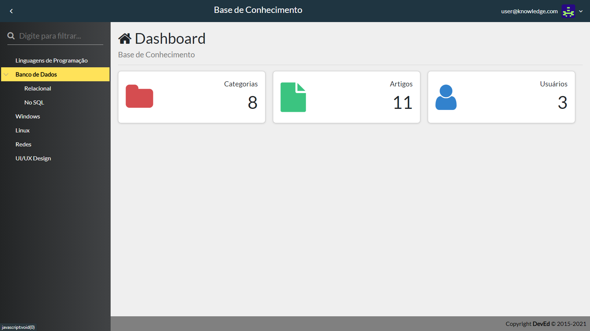
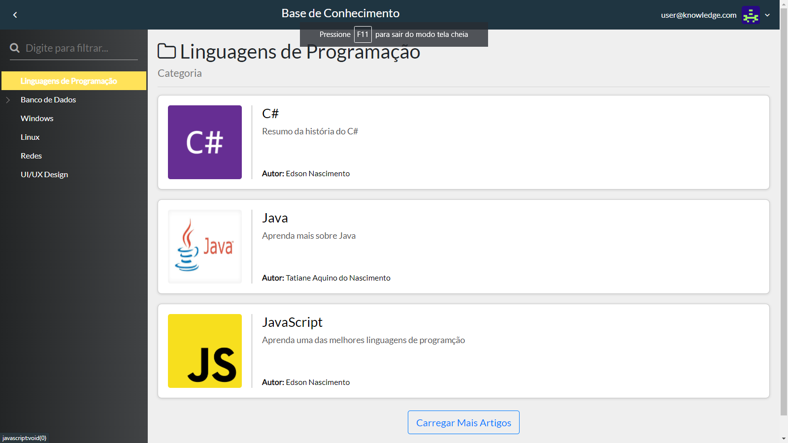
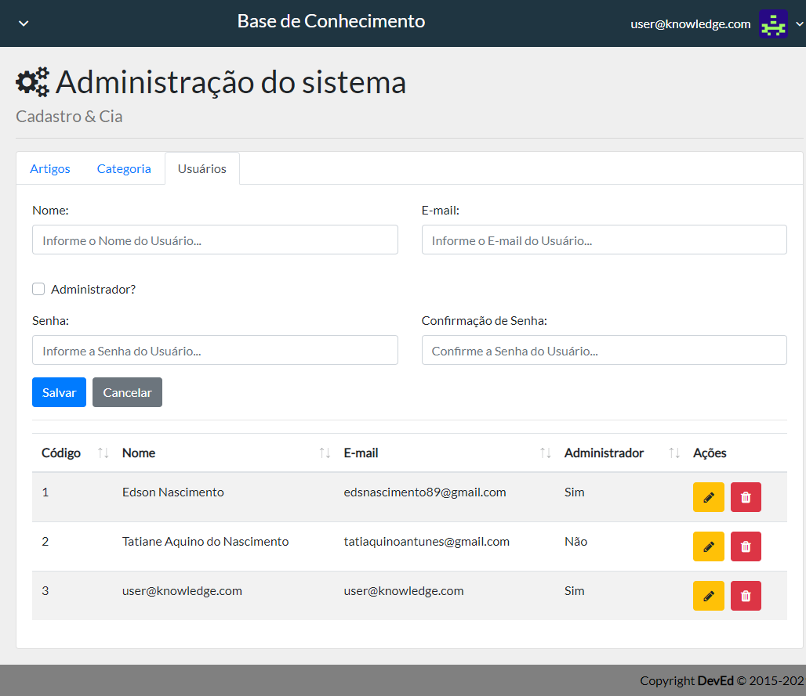
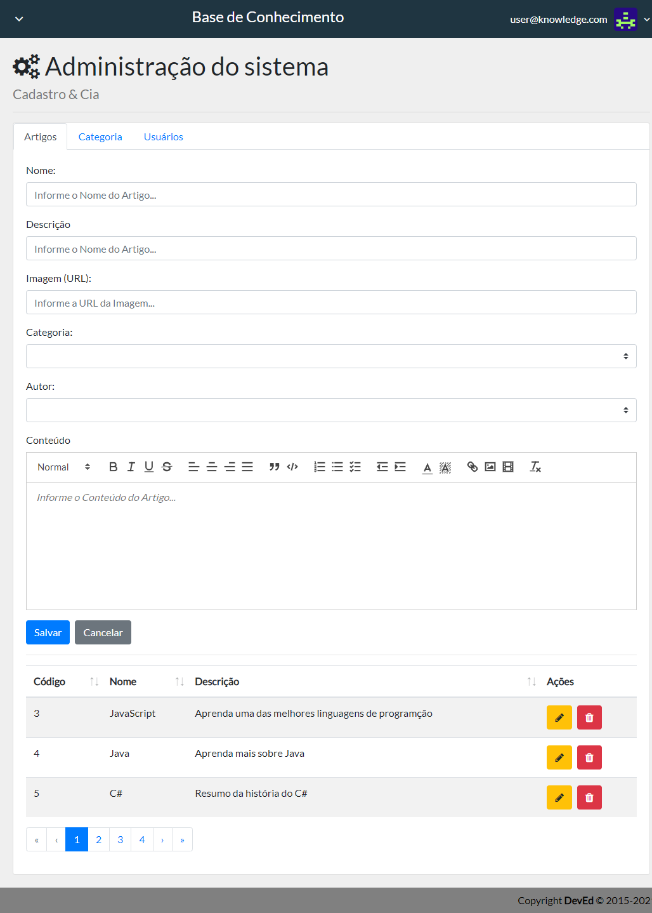
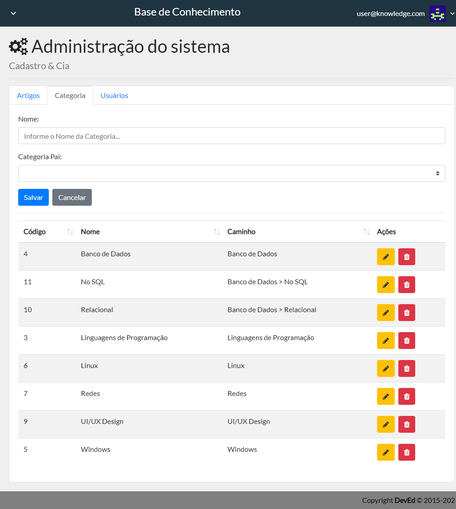

# Knowledge


<p align="center">
  <a href="#-tecnology">Tecnology</a>&nbsp;&nbsp;&nbsp;|&nbsp;&nbsp;&nbsp;
  <a href="#-project">Project</a>&nbsp;&nbsp;&nbsp;|&nbsp;&nbsp;&nbsp;
  <a href="#-license">License</a>
</p>

<p align="center">
 

  
</p>

<br>

## 💻 Project

##### Projeto final do curso Web Moderno da Cod3r 

<p>Trata-se de uma plataforma para registrar e compartilhar artigos, entre os usuários cadastrados podendo organizar os artigos por categorias.</P>

# Preview 🛰

<p align="center">
  
</p>
<p align="center">
  
</p>
<p align="center">
  
</p>
<p align="center">
  
</p>
<p align="center">
  
</p>
<p align="center">
  
</p>

## 🚀 Technology

This project was developed with the following technologies:

<b>Backend</b>
- [Node JS]()
- [Postgres]()
- [Mongo DB]()
- [Express]()
- [Mongoose]()
- [Knex]()

<b>Frontend</b>
- [Vue JS]()
- [Axios]()
- [Font-awesome]()
- [Bootstrap-vue]()


## 🛠 Install

1. Clone o repositório:

   ```bash
   $ git clone https://github.com/edsnasc/knowledge.git
   ```
2. configure o banco de dados de sua preferencia no arquivo
    
    ```bash
   renomeie o _env para .env e edite os dados no arquivo
   ```

3. instale o knex de forma global e execute o comandos para criar as tabelas no banco

    ```bash
   $ knex migrate:latest
   ```
4. execute o comando 

    ```bash
   $ npm start --backend
   $ npm run serve --frontend
   ```


## 📝 License

This project is under the MIT license. See the [LICENSE] file (LICENSE.md) for more details.

---

Created by Edson Nascimento / [LinkedIn](https://www.linkedin.com/in/edson-nascimento-5783681aa/)
